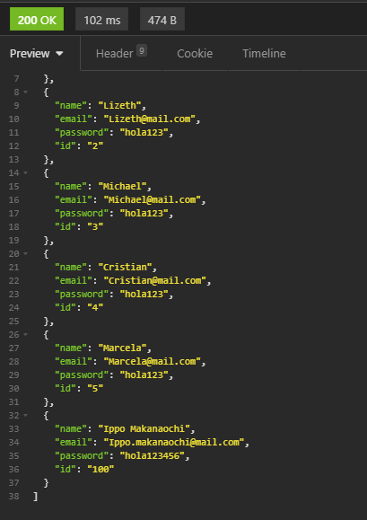

# IETI-Lab-6


La presencia de este documento en este repositorio es un compromiso explícito de los colaboradores de seguir el siguiente código de honor:

Código de Honor
------
Debes seguir el Código de honor del ingeniero de sistemas para defender el estándar de integridad académica de la ECI:

- Tus respuestas a tareas, cuestionarios y exámenes deben ser tu propio trabajo (excepto para las tareas que permiten explícitamente la colaboración).

- No puedes compartir tus soluciones de tareas, cuestionarios o exámenes con otra persona a menos que el instructor lo permita explícitamente. Esto incluye cualquier cosa escrita por ti, como también cualquier solución oficial proporcionada por el docente o el monitor del curso.

- No puedes participar en otras actividades que mejorarán de manera deshonesta tus resultados o que mejorarán de manera deshonesta o dañarán los resultados de otras personas.

------

```
Credentials
	username: edkillah@mail.com
	password: 654321
```

You can find the backend deploy on heroku in the next link: 

[](https://cryptic-reef-04829.herokuapp.com/users/)

You cand find the deploy on Firebase in the next link:

[https://ieti-lab-6.web.app/](https://ieti-lab-6.web.app/)

----
#### It's recommended to use programs like "Postman" or "Insomnia" to test the API 
In backend API you can use the nexts URLs to access to the API resources:


##### First at all, load the users going to the next link: 

[https://cryptic-reef-04829.herokuapp.com/users](https://cryptic-reef-04829.herokuapp.com/users)


* To see information from a particular user
[https://cryptic-reef-04829.herokuapp.com/user/1](https://cryptic-reef-04829.herokuapp.com/user/1)


* To create a new user send it in the body from the GET Request (If you dont pass any user it'll create a default user)
[https://cryptic-reef-04829.herokuapp.com/create](https://cryptic-reef-04829.herokuapp.com/create)


* To update an existing user send it in the body from the GET Request
[https://cryptic-reef-04829.herokuapp.com/update](https://cryptic-reef-04829.herokuapp.com/update)


#### User updated




* To delete an user use the next link:
[https://cryptic-reef-04829.herokuapp.com/delete/1](https://cryptic-reef-04829.herokuapp.com/delete/1)

## Working in deploy apps

Backend on heroku:


Frontend on Firebase charging the data from the backend:


For the last, you can find the code from the frontend in the next link:
https://github.com/EdKillah/IETI-Lab-6-FRONTEND

This is the same code used in IETI-Lab-5 but with the fetch to use the resources from the backend (Only App.js class was modified)
